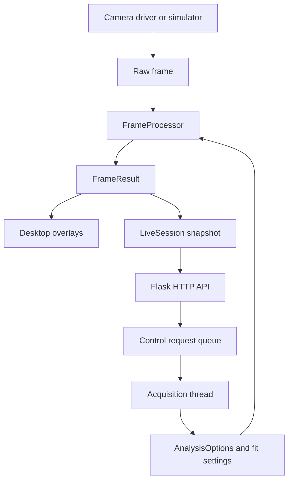

# Code structure

Beam Profiler is a Python application. Camera acquisition, numerical analysis,
window rendering and HTTP access have separate responsibilities.

## Where to work

| File or directory | Responsibility |
|---|---|
| `beam_profiler/__main__.py` | Launch options, camera discovery and cleanup |
| `beam_profiler/cameras/` | Vendor SDK access, exposure, hardware ROI and simulator |
| `beam_profiler/processing/pipeline.py` | Frame analysis and its input/result contracts |
| `beam_profiler/processing/measurements.py` | Spacing statistics, grid grouping and smoothing history |
| Other `processing/` modules | Numerical fitting, detection, region statistics and saturation |
| `beam_profiler/session.py` | Complete snapshots and queued control requests across threads |
| `beam_profiler/ui/viewer.py` | Acquisition loop, user input, camera controls and display coordination |
| `beam_profiler/ui/overlays.py` | Draw measurements without recalculating fits |
| `beam_profiler/ui/settings.py` | Tk settings controls |
| `beam_profiler/ui/macos.py` | Native macOS window/input integration |
| `beam_profiler/server.py` | HTTP routes consuming a session, with no viewer or camera dependency |
| `beam_profiler/roi.py` | Sensor/ROI/display coordinate conversions |
| `beam_profiler/fitconfig.py` | Fitting settings and persistence |
| `beam_profiler/status.py` | Save a camera-control snapshot to disk |
| `tools/make_readme_demos.py` | Simulator examples through the same analysis pipeline and renderer |

## Analysis contract

`FrameProcessor.process()` accepts an owned raw NumPy frame, its camera ROI,
pixel pitch, output full scale, and `AnalysisOptions`. It does not open a camera,
create windows, serve HTTP or write files. A caller can supply a `FitConfig`;
otherwise it takes the currently active settings at the start of processing.

`AnalysisOptions` selects single-beam or multi-spot fitting and the white/green
rectangles. Rectangles use sensor coordinates. Detected centers use ROI-relative
coordinates; `roi.py` handles conversion for display.

The returned `FrameResult` contains the raw frame and matching ROI, options,
spots, saturation flags, spacing statistics, optional white-region statistics,
profiler diagnostic and processing timestamp. The processor keeps smoothing
history, but creates a separate statistics state for each result. Processing the
next frame does not change the previous result's statistics. Switching cameras
starts a new processor, clearing the old camera's history.

Treat results and their nested arrays/dictionaries as read-only. The frozen
result dataclass prevents field reassignment; it does not deep-freeze NumPy
arrays. Camera backends supply owned frames so SDK buffers cannot overwrite
published images. This avoids another full-frame copy during publication.

## Thread ownership

The main thread still acquires, analyzes and draws frames sequentially, and pumps
OpenCV/Tk events. This refactor does not introduce background fitting or promise
higher FPS. GPU selection remains inside the existing numerical fitting code.

`LiveSession` publishes an entire `SessionSnapshot` under a short lock. Each HTTP
request reads it once and keeps that snapshot throughout the request. Camera
status, image geometry and analysis therefore refer to the same published frame,
even when the camera changes ROI while a request is being served.

Browser requests to change rectangles or fitting settings enter a queue. The main
thread applies them before its next acquisition. Flask never touches a camera or
Tk widget. Reads immediately after a write may still describe the preceding
frame; wait for a new result timestamp before interpreting updated measurements.
The settings PUT response describes the accepted configuration; GET describes the
configuration currently applied.

The HTTP listener remains live after W hides rectangle statistics. Published
measurements continue updating, avoiding a mixture of fresh spots and stale
spacing statistics. JPEG encoding and JSON serialization happen when requested,
not on every camera frame.

## Branch-specific behavior

`main` and `grid-distortion` share the pipeline and session contracts. Distortion
adds `angular.py`, the spacing window and angular HTTP routes. Angular processing
remains an optional separate computation; its latest result travels with the
same session snapshot. Main retains its auto-exposure A shortcut.

The GUI still combines OpenCV, Tk and native macOS event handling. Replacing that
with one GUI toolkit is a separate migration, not part of this refactor.

## Verification

`test_pipeline.py` exercises analysis without a GUI; `test_session_api.py` checks
snapshot consistency, queued controls and the real viewer loop with native window
calls disabled. The numerical, ROI, exposure and keyboard regression tests cover
the existing behavior. Native GUI and live-camera checks remain separate from
these simulated tests.
