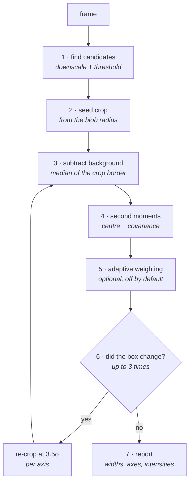

# How a spot is fitted

What the profiler does to turn one camera frame into a list of measured spots.

Everything here is tunable from the settings window (press `o` in the viewer);
the setting that controls each step is named as it comes up. Why the defaults
are the values they are is a separate story —
[fitting-calibration.md](fitting-calibration.md).

## What you get back

For every spot found, in pixels of the grabbed frame:

| | |
|---|---|
| `x`, `y` | centre, sub-pixel |
| `sigma_0`, `sigma_1` | major and minor width — **2× the Gaussian σ**, so ≈ the waist per axis |
| `sigma` | the two widths combined, `√(sigma_0 · sigma_1)` |
| `vec_0`, `vec_1` | unit vectors along those two axes |
| `I0` | peak intensity — the pixel value at the centre |
| `I0_weighted` | peak estimated from the mean inside the 1σ ellipse; steadier than `I0` |

## The seven steps

### 1. Find candidates

The frame is shrunk to at most 1024 px on its long edge, blurred, contrast-
normalised and Otsu-thresholded into a black-and-white mask; OpenCV's
`SimpleBlobDetector` then finds the blobs in it. Each blob gives a rough
position and a rough radius.

That is all the detector is for. **The blur and the downscale never touch the
data that gets fitted** — the mask is thrown away and every later step reads
the original, full-resolution frame.

### 2. Take a seed crop

Cut a box around the candidate, `seed_window` × the blob radius wide (default
2×). This first box only has to be roughly right; step 6 fixes it.

One hard limit applies from here on: a crop is never allowed to grow past
`neighbour_fraction` × the distance to the nearest other candidate (default
half-way), so a spot can never swallow its neighbour.

### 3. Subtract the local background

Take the median of the pixels around the crop's border and subtract it from
the whole crop (`subtract_background`). Border pixels are mostly background,
so this removes the camera's offset and any local stray light — which would
otherwise inflate the width badly, since a constant pedestal spread over a
wide box looks like a very wide spot.

Negative values are **kept**, not clipped to zero (`clip_negative`, off). Noise
is symmetric about zero, so the negatives cancel the positives and contribute
nothing on average. Clipping them away leaves only the positive half, which
quietly turns noise into signal — see the calibration notes; this is the single
easiest way to get badly wrong widths.

### 4. Measure the second moments

Treat the crop as a distribution of light and take its moments:

- **centre** = the intensity-weighted mean position,
- **covariance** = the intensity-weighted spread about that centre, as the
  three numbers `cxx`, `cyy`, `cxy`.

No curve fitting, no starting guess, no iteration that can fail to converge —
just weighted sums. That is why it survives thousands of spots per frame.

### 5. Optional: weight instead of cut

Still inside the same pass. With `adaptive_iters` > 0 the hard-edged box is
replaced by a smooth Gaussian weight shaped like the spot, so distant pixels
fade out instead of being chopped off. Weighting narrows what you measure, but
by an exactly known factor — for a Gaussian the true covariance is simply twice
the measured one — so it can be undone with no fudge factor. Re-measure, reshape
the weight, repeat until it stops moving.

The payoff is that the answer stops depending on where you drew the box at all.
The cost is one extra pass over the crop per iteration, which is affordable on
the GPU and not on the CPU. Off by default.

### 6. Re-crop from the answer, and repeat

Now that the spot's own width is known, throw the seed box away and cut a new
one, `crop_sigma` × the fitted σ (default 3.5) — measured **separately for each
axis**, so an elongated spot gets an elongated box rather than a square one
sized by its long side. Go back to step 3 and measure again.

This repeats `crop_stages` times (default 3). It matters because the blob
detector's radius is unreliable — a faint spot gets cut higher up its profile
and reads smaller — and if the box came from that radius, the measured width
would depend on how bright the spot happened to be. Deriving the box from the
spot itself breaks that link. A pass whose box comes out unchanged is skipped:
the result depends only on the box, so it would repeat itself exactly.

### 7. Report

Rotate the covariance onto its own axes (a 2×2 eigen-decomposition). The two
eigenvalues give `sigma_0` and `sigma_1`, the eigenvectors give `vec_0` and
`vec_1`. `I0` is read at the centre pixel; `I0_weighted` is the mean over the
1σ ellipse, divided by the known 0.787 mean-to-peak ratio of a Gaussian over
that region.

## A worked example

An 80×80 array on a 4096² sensor: pitch 50 px, σ ≈ 5 px.

| step | result |
|---|---|
| candidate | blob radius ≈ 7.8 px, i.e. 1.55σ |
| neighbour limit | 25 px (half the 50 px pitch) — never reached |
| seed crop | 2 × 7.8 → 32×32 px |
| after pass 1 | σ ≈ 5.0 → new box 3.5 × 5.0 → 36×36 px |
| passes 2–3 | box unchanged, skipped |
| reported | `sigma_0` ≈ 10 px (= 2σ), centre good to ~0.01 px |

## What it assumes, and where it breaks

- **The border is background.** If the crop border still sits on the spot's
  wings, the background comes out too high and the width slightly too small.
- **Neighbours are far enough apart.** Spots closer than about three times
  their combined width start leaking into each other's crops. The neighbour
  limit prevents disaster, not contamination.
- **The spot is roughly Gaussian.** For a flat-top or heavily clipped beam the
  second moment is still well defined, but `I0_weighted` and the adaptive mode
  both assume a Gaussian shape.
- **Saturation is not detected.** A clipped peak reads as a wider, flatter
  spot and nothing warns you.
- **Spots at the frame edge** get a box that runs off the sensor; it is shifted
  inwards to stay whole, which biases a spot sitting right on the edge.

## Where the code lives

| | |
|---|---|
| `processing/blobs.py` | step 1 |
| `processing/fit.py` | steps 2–7 — `fit_spot` is the readable scalar version |
| `processing/gpu.py` | the same maths as one fused CUDA kernel |
| `fitconfig.py` | every knob, its range and its help text |
| `ui/settings.py` | the settings window, generated from that registry |

The scalar, batched-numpy and CUDA implementations are held to agreeing within
1e-9 by the test suite, so `fit_spot` can be read as the definition of what the
other two do.
