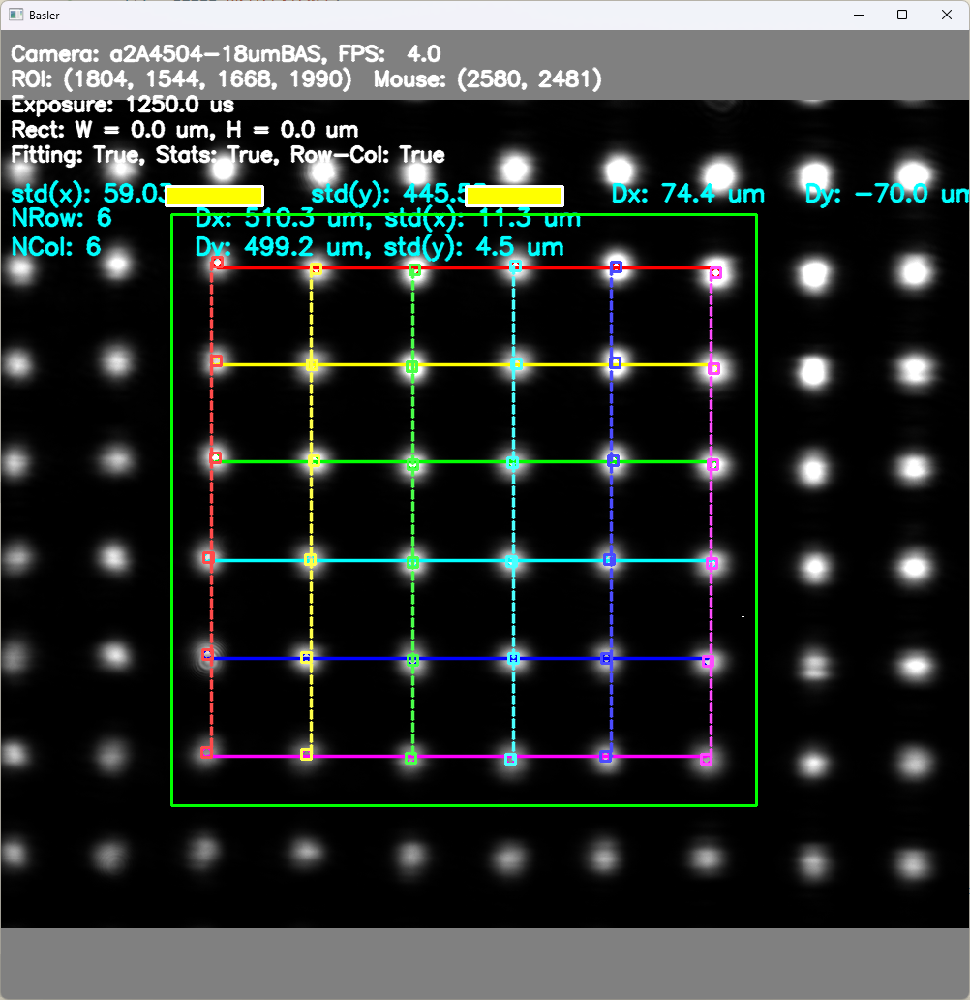

# Basler Beam Profiler

**Mac + FLIR:** after [setup](docs/macos.md#installation), double-click `Launch FLIR.command`, or run `./run.sh --camera flir`.
See [Mac setup, controls, and tested capabilities](docs/macos.md). This version
supports the FLIR BFS-U3-31S4M-C and keeps the original shared analysis tools.
Basler users additionally install `requirements-basler.txt`.

A Python application for live laser-beam profiling with Basler cameras: spot
detection, sub-pixel 2D Gaussian fits, beam-array (grid) statistics, an HTTP
API and hardware sync outputs.



## Usage

```bash
pip install -r requirements.txt
python -m beam_profiler            # live camera (falls back to the simulator)
python -m beam_profiler --sim      # simulated camera, no hardware needed
python pylon_camera.py             # legacy entry point, same application
```

### Simulated camera

`--sim` (or having no camera connected) renders a fixed grid of Gaussian spots
with realistic noise in real time, so every CV function — blob detection,
Gaussian fitting, row/column statistics, auto-exposure — can be exercised
without hardware:

```bash
python -m beam_profiler --sim --sim-grid 8x8 --sim-jitter 0   # static 8x8 grid
python -m beam_profiler --sim --sim-size 4096x4096 --sim-grid 80x80   # dense array
```

The spot sigma defaults to pitch/10 (beam waist = 1/5 of the spot spacing);
override with `--sim-sigma <px>`.

Fixed spot pictures with ground-truth JSON (for offline testing) are generated
with:

```bash
python tools/make_test_images.py   # writes test_images/*.png/.npy/.json
```

### Architecture

```
beam_profiler/
├── __main__.py        CLI entry point
├── config.py          paths, constants, camera_config.yaml loading
├── synthetic.py       synthetic spot images (simulator, tests, tools)
├── roi.py             ROI zoom model + sensor<->display mapping
├── cameras/           base.py (interface + auto-exposure), basler.py, simulated.py
├── processing/        blobs.py (detection + Gaussian fits), grid.py, stats.py
├── ui/                viewer.py (main loop, input), overlays.py (HUD, bars)
├── server.py          Flask HTTP API
└── status.py          pylon_camera.json mirror
```

Spot detection runs on a ≤1024 px downscale of the frame and refines each spot
with a sub-pixel moment fit on a full-resolution crop, so even 25 MP sensors
profile at interactive rates.

### Tests

```bash
pip install pytest
pytest
```

The tests validate the CV pipeline against synthetic images with known ground
truth (positions, widths, orientation, grid classification).

### Configuring the camera

`camera_config.yaml`

```yaml
cameras:
  a2A5060-15umBAS:                     # must match the camera model name
    default_roi: [5060, 5060, 4, 4]    # [width, height, x_pad, y_pad]
    pixel_size: 2.5e-6                 # pixel size in meters, i.e. 2.5um
```

### Using the compiled application

First clone this repo and set up `camera_config.yaml`.

Check release to download the latest version: [Releases](https://github.com/tim4431/Basler_Beam_Profiler/releases)

Put the `pylon_camera.exe` executable in the same directory as `camera_config.yaml`.
Saved frames (`data/`) and the live status file (`pylon_camera.json`) are written
next to the executable.

### Keyboard Shortcuts
- `Esc`: Quit the application
- `arrow keys`: up/down=change exposure by 10 times, left/right=change exposure by 10%
- `a`: toggle auto-exposure (auto exposure adjusts the exposure time to keep the max intensity to be near-saturated)
- `f`: toggle blob fitting
- `g`: toggle statistics showing (statistics of fitted blobs)
- `h`: toggle row/col statistics (works only for beam arrays)
- `mouse drag`: create a white rectangle in the canvas
- `c`: clear the white rectangle
- `ctrl + mouse drag`: create a green rectangle in the canvas, only blobs inside the rectangle will be fitted
- `v`: clear the green rectangle
- `s`: quick save the current frame (JPEG + raw `.npy`)
- `d`: save the current frame with dialogue box, allowing the user to choose the file location and name
- `t`: switch to the next camera (if multiple cameras are connected)
- `o`: open the spot-fitting settings window (crop size, re-crop stages, adaptive weighting, GPU backend)
- `w`: toggle the HTTP server (port 5000), together with the live pixel statistics of the white rectangle drawn on the canvas
- `y`: toggle the user-defined line output (Line3) used to sync external hardware
- `mouse wheel`: zoom in/out the canvas (`ctrl + wheel`: change aspect ratio)

## Spot fitting settings

Press `o` for a settings window covering every parameter of the fit: the crop
size, how many times the crop is re-derived from the fitted width, whether to
use adaptive Gaussian weighting, and the CUDA backend. Changes take effect on
the next frame and persist to `fit_config.json` next to the app; the same
values are readable and writable over HTTP at `/api/fit_config`.

Each control explains itself in the help pane. The defaults are measured
optima rather than guesses. [`docs/fitting.md`](docs/fitting.md) walks through
the fitting method step by step, and
[`docs/fitting-calibration.md`](docs/fitting-calibration.md) records the sweeps
behind each default - the test suite re-runs those measurements.

## Remote control / readout

Pressing `w` starts a small HTTP server on port 5000 that exposes the camera
status, the current frame, and the pixel statistics of the white / green
rectangles. Open <http://localhost:5000> for the endpoint list, or see
[docs/web_api.md](docs/web_api.md) for the full reference.

The current state (camera, exposure, ROI, rectangles) is also mirrored to
`pylon_camera.json` whenever it changes, so another process can read it without
starting the server.

## Hardware sync

The camera is armed with a software trigger, and drives two GPIO lines:

- **Line2** - inverted `ExposureActive`, i.e. it mirrors the exposure window.
- **Line3** - user-controlled output, toggled with `y`. While enabled it is
  pulsed low for the duration of each acquisition.

Cameras that do not expose these lines (or the software trigger) log a warning at
startup and keep running with that feature disabled.
