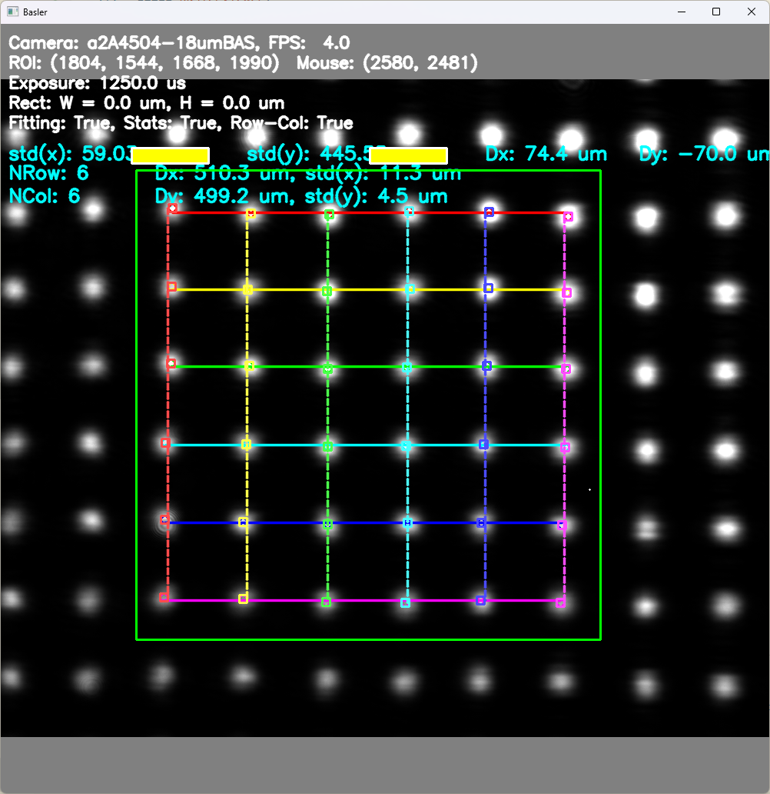

# Basler / FLIR Beam Profiler for macOS

**Mac + FLIR:** double-click `Launch FLIR.command`, or run `./run.sh --camera flir`.
See [Mac setup, controls, and tested capabilities](docs/macos.md). This version
supports the connected BFS-U3-31S4M-C and keeps the original shared analysis tools.
Basler users additionally install `requirements-basler.txt`.

A Python application for live laser-beam profiling with Basler cameras: spot
detection, sub-pixel 2D Gaussian fits, beam-array (grid) statistics, an HTTP
API and hardware sync outputs.



## Usage

```bash
pip install -r requirements.txt
python -m beam_profiler            # live camera (falls back to the simulator)
python -m beam_profiler --sim      # simulated camera, no hardware needed
python pylon_camera.py             # legacy entry point, same application
```

### Single-beam profiler

Press **P** in the viewer to toggle the single-beam profiler. It fits one rotated
elliptical Gaussian plus a constant background over the whole camera image,
without blob detection or spot crop limits. Shift-drag a green fitting rectangle
to restrict the fit; press `v` to clear it. The overlay reports 1/e² radii and
flags beams that reach the region boundary. This is a Gaussian model estimate,
not an ISO second-moment measurement. Saturated or insufficient-contrast images
produce a diagnostic rather than a fitted ellipse. Press P again to return to
the previous array-fitting mode. Press `f` or `F` to switch directly to multi-beam
fitting; press it again to turn multi-beam fitting off. Profiler calculations
currently run on the CPU.

### Simulated camera

`--sim` (or having no camera connected) renders a fixed grid of Gaussian spots
with realistic noise in real time, so every CV function — blob detection,
Gaussian fitting, row/column statistics, auto-exposure — can be exercised
without hardware:

```bash
python -m beam_profiler --sim --sim-grid 8x8 --sim-jitter 0   # static 8x8 grid
python -m beam_profiler --sim --sim-size 4096x4096 --sim-grid 80x80   # dense array
```

The spot sigma defaults to pitch/10 (beam waist = 1/5 of the spot spacing);
override with `--sim-sigma <px>`.

Fixed spot pictures with ground-truth JSON (for offline testing) are generated
with:

```bash
python tools/make_test_images.py   # writes test_images/*.png/.npy/.json
```

### Architecture

```
beam_profiler/
├── __main__.py        CLI entry point
├── config.py          paths, constants, camera_config.yaml loading
├── synthetic.py       synthetic spot images (simulator, tests, tools)
├── roi.py             ROI zoom model + sensor<->display mapping
├── cameras/           base.py (interface + auto-exposure), basler.py, simulated.py
├── processing/        blobs.py (detection + Gaussian fits), grid.py, stats.py
├── ui/                viewer.py (main loop, input), overlays.py (HUD, bars)
├── server.py          Flask HTTP API
└── status.py          pylon_camera.json mirror
```

Spot detection runs on a ≤1024 px downscale of the frame and refines each spot
with a sub-pixel moment fit on a full-resolution crop, so even 25 MP sensors
profile at interactive rates.

### Tests

```bash
pip install pytest
pytest
```

The tests validate the CV pipeline against synthetic images with known ground
truth (positions, widths, orientation, grid classification).

### Configuring the camera

`camera_config.yaml`

The bundled [camera catalog](docs/camera-catalog.md) includes verified FLIR and
Basler sensor sizes and pixel pitches, with a manufacturer source for each entry.
Installed apps load new bundled models alongside your saved configuration.

```yaml
cameras:
  a2A5060-15umBAS:                     # must match the camera model name
    default_roi: [5060, 5060, 4, 4]    # [width, height, x_pad, y_pad]
    pixel_size: 2.5e-6                 # pixel size in meters, i.e. 2.5um
```

### Using the compiled application

First clone this repo and set up `camera_config.yaml`.

Check release to download the latest version: [Releases](https://github.com/tim4431/Basler_Beam_Profiler/releases)

Put the `pylon_camera.exe` executable in the same directory as `camera_config.yaml`.
Saved frames (`data/`) and the live status file (`pylon_camera.json`) are written
next to the executable.

### Camera-window controls

All letter shortcuts accept either case, with or without Caps Lock.

| Key / gesture | Action |
|---|---|
| `F` | Toggle multi-spot fitting; switches out of single-beam mode |
| `P` | Toggle single-beam profiler |
| `G` | Show/hide statistics |
| `H` | Show/hide row/column grid display; grid statistics are calculated automatically |
| `A` | Toggle auto-exposure |
| `O` | Open settings |
| ↑ / ↓ | Exposure ×10 / ÷10 |
| → / ← | Exposure +10% / −10% |
| Scroll | Zoom by changing the camera's hardware ROI |
| Control or Shift + scroll | Change hardware ROI aspect ratio |
| Click-drag | Draw white region for pixel statistics |
| Control or Shift + click-drag | Draw green fitting region |
| `C` | Clear white region |
| `V` | Clear green region |
| Hover | Show sensor coordinates and raw pixel intensity |
| `S` | Save grayscale JPEG and raw `.npy` into `data/` |
| `D` | Save with a filename/location dialog |
| `T` | Switch to next connected camera |
| `W` | Enable web view and white-region statistics; pressing again disables live statistics updates (the HTTP listener stays running) |
| `Y` | Toggle configured camera output, where supported |
| Esc / window close | Exit |

A green fitting rectangle does not reduce camera readout. Hardware ROI changes do.
Spot detection uses a 1,048,576-pixel budget, preserving aspect ratio: a long,
narrow ROI below this budget is searched at full resolution. Fitting always uses
full-resolution pixels. This budget is currently a code constant, not a setting.

## Spot fitting settings

Press **O** to open these settings. These are factory defaults; saved values
may differ. Numeric changes apply after **Enter or leaving the field**, and are
saved to `fit_config.json` in the app's writable data directory. Checkbox changes
apply immediately. These crop/estimator controls configure multi-spot fitting;
the single-beam profiler has its own estimator.

| Setting | Default | Available range / purpose |
|---|---:|---|
| Heatmap colors | Off | Heatmap or grayscale; raw pixels remain unchanged |
| Crop half-width | 3.5 × σ | 1.5–12; fitting region around each spot |
| Re-crop stages | 3 | 0–8; refine the fitting region |
| Adaptive weight iterations | 0 | 0–20 |
| Seed crop | 2 × blob radius | 1–6 |
| Subtract local background | On | Background subtraction during spot fitting |
| Clip negatives to zero | Off | Clip negative background-subtracted values |
| Max crop / neighbor distance | 0.5 | 0.1–1 |
| Crop size quantum | 4 px | 1–32 |
| Minimum crop | 3 px | 3–64 |
| Maximum crop | 512 px | 16–4096 |
| Use CUDA when available | On | NVIDIA acceleration; Apple Silicon uses CPU |
| Minimum spots for CUDA | 400 | 1–100,000 |

The window also provides **Restore defaults**, **Reload from file**, and **Close**.
The same settings are available through `/api/fit_config`.

Each control explains itself in the help pane. The defaults are measured
optima rather than guesses. [`docs/fitting.md`](docs/fitting.md) walks through
the fitting method step by step, and
[`docs/fitting-calibration.md`](docs/fitting-calibration.md) records the sweeps
behind each default - the test suite re-runs those measurements.

## Remote control / readout

Pressing `w` starts a small HTTP server on port 5000 that exposes the camera
status, the current frame, and the pixel statistics of the white / green
rectangles. Open <http://localhost:5000> for the endpoint list, or see
[docs/web_api.md](docs/web_api.md) for the full reference.

The current state (camera, exposure, ROI, rectangles) is also mirrored to
`pylon_camera.json` whenever it changes, so another process can read it without
starting the server.

## Hardware sync

The camera is armed with a software trigger, and drives two GPIO lines:

- **Line2** - inverted `ExposureActive`, i.e. it mirrors the exposure window.
- **Line3** - user-controlled output, toggled with `y`. While enabled it is
  pulsed low for the duration of each acquisition.

Cameras that do not expose these lines (or the software trigger) log a warning at
startup and keep running with that feature disabled.

Display colors can be changed with **O → Display → Heatmap colors**. The choice
is saved locally; raw frames and fitted measurements are unchanged.
