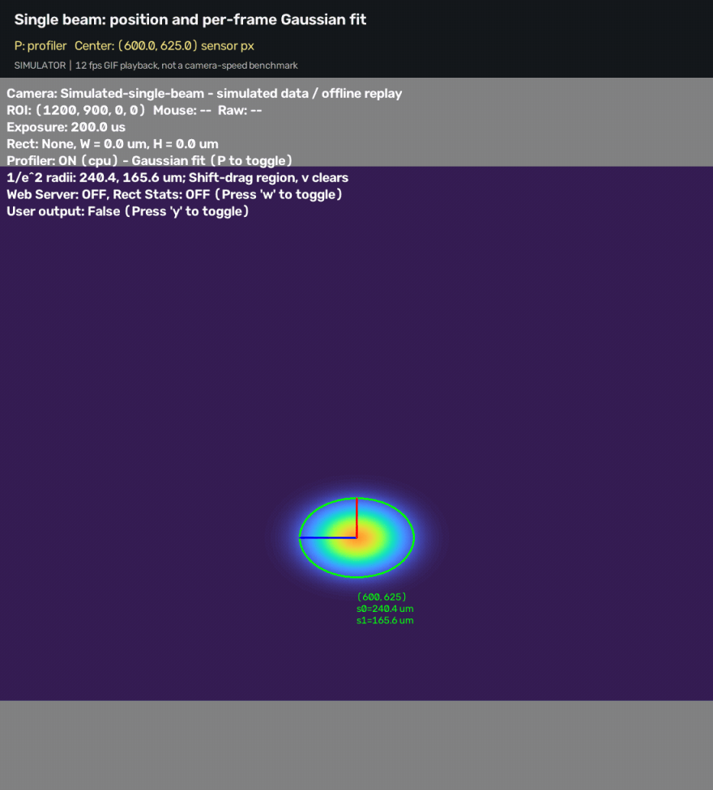
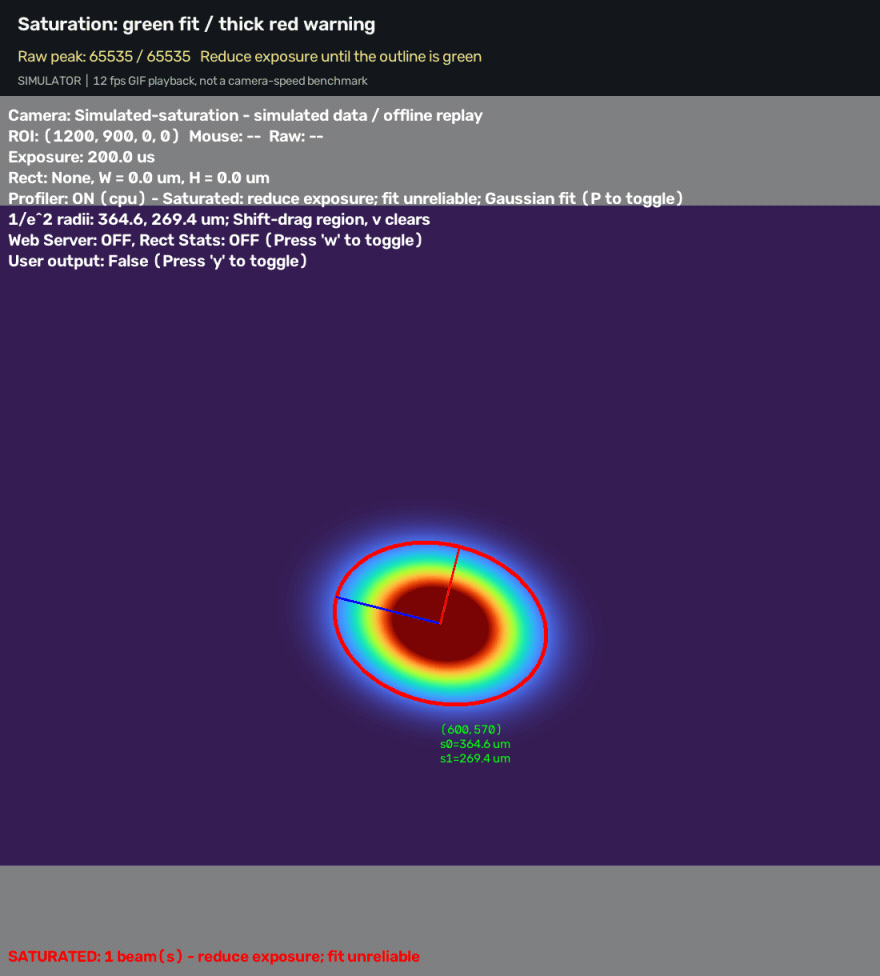
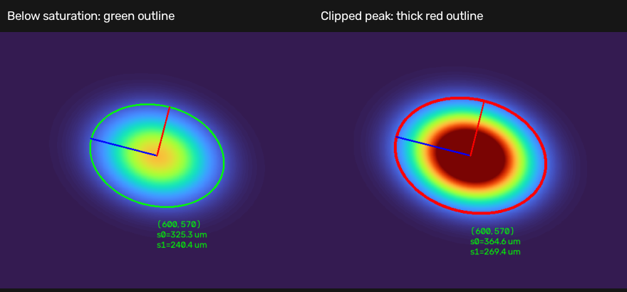
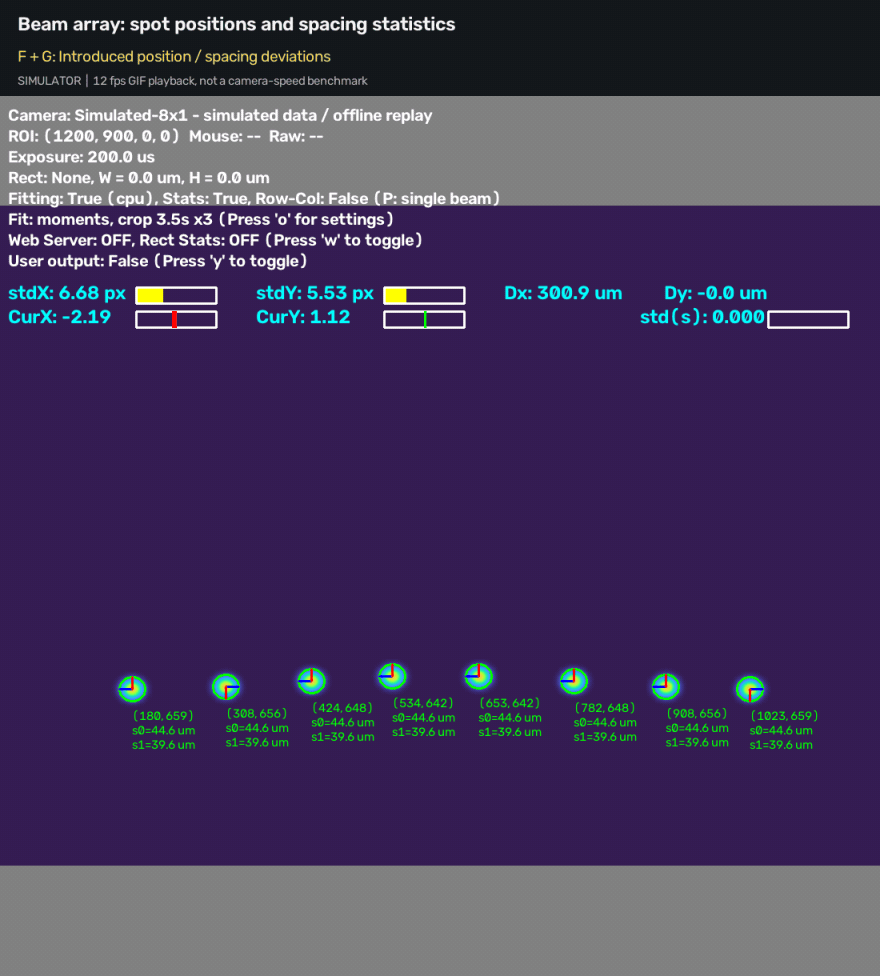
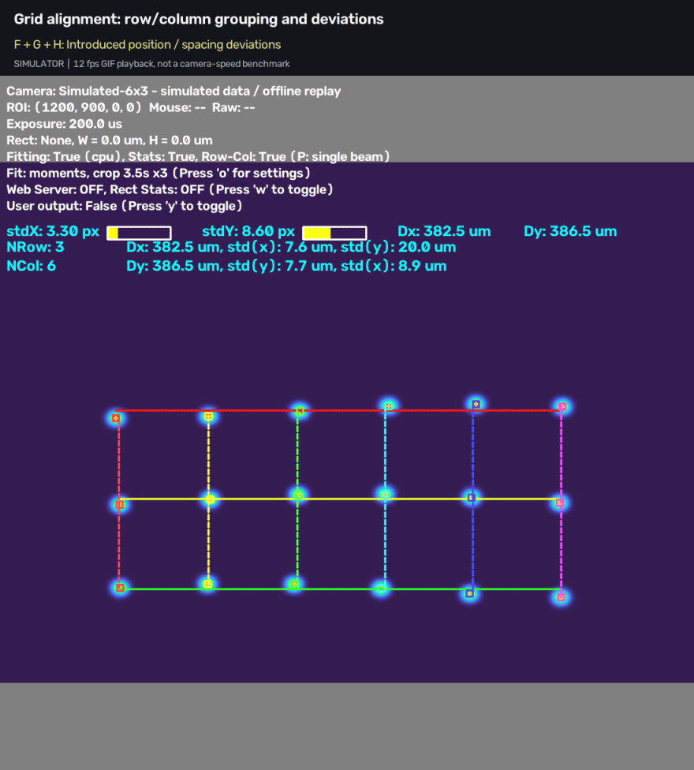
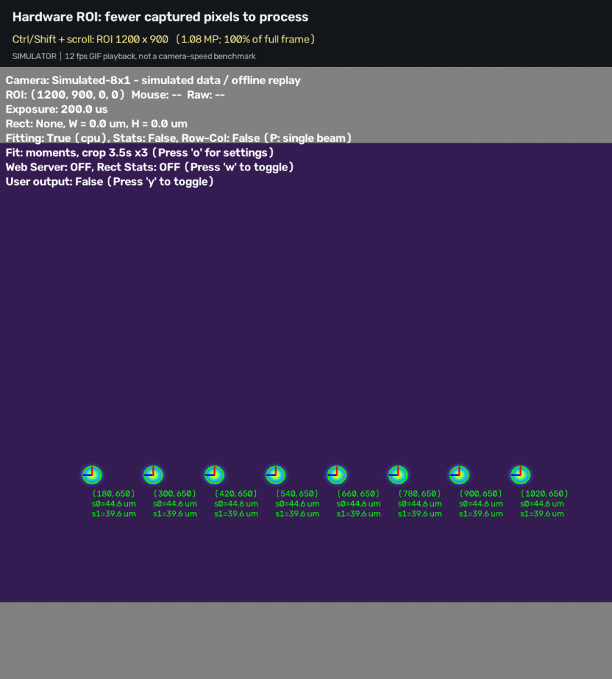
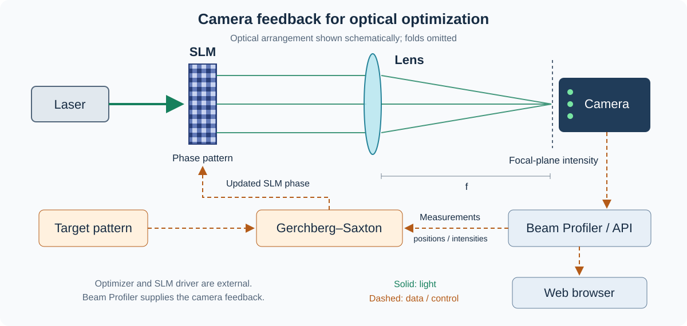

# Beam Profiler

Live laser-beam profiling with **Basler and FLIR cameras**, with standalone apps
for **Windows and Apple Silicon macOS**. Measure a single beam or an array of
spots, inspect raw pixel intensities, and save full-depth camera frames.

[Download the latest release](https://github.com/laserroger/Basler_Beam_Profiler/releases/latest)
· [macOS setup](docs/macos.md) · [Windows setup](docs/windows.md)
· [Camera catalog](docs/camera-catalog.md)

> **This is the `grid-distortion` branch.** It includes the released app's tools
> plus an experimental angular-spacing plot. Here, **A opens that plot**; on
> [main](https://github.com/laserroger/Basler_Beam_Profiler/tree/main), **A toggles
> auto-exposure**. Release downloads are built from main.

## Install and start

The release downloads include Python and the camera runtime libraries. You do
not need to clone this repository or install Python to use them.

| Platform | Download | Start |
|---|---|---|
| Windows x64 | `BeamProfiler-Windows-x64-Setup.exe` | Run the installer, approve driver installation, then launch Beam Profiler |
| Apple Silicon, macOS 26+ | `pylon_camera-macos-arm64.dmg` | Open the disk image, drag `pylon_camera.app` into Applications, then open it |

The macOS app is ad-hoc signed, not notarized. If macOS blocks it, follow the
opening instructions in the [Mac guide](docs/macos.md).

Connect the camera and close any other application using it. The default launch
searches for FLIR and Basler cameras. **If no hardware opens, auto mode falls back
to simulated data.** When running from source, use `--camera flir` or
`--camera basler` to require real hardware and report a connection failure.

## Use cases

These animations use the application's simulator, fitting code and viewer overlays.
Their 12 FPS playback is for illustration, not a camera-speed measurement.

### Beam profiler: locate and fit a moving beam

Press **P** to locate a beam and fit its position, elliptical shape and size on
each frame. The fit uses the current frame, without temporal averaging. A smaller
camera ROI can reduce processing time; the viewer's upper limit is 60 FPS, and
actual performance depends on the camera, exposure and computation.



The overlay reports **1/e² radii**, not diameters or FWHM. The model is a rotated
elliptical Gaussian plus a constant background, not an ISO second-moment
measurement. Diagnostics identify insufficient contrast, saturation or a fitted
contour extending beyond the selected region.

### Check for saturation

A **green outline** means no pixels within that fitted ellipse reach the
saturation warning threshold. A **thick red outline** means at least one raw
pixel reaches 99.9% of the camera's output range. The tolerance covers cameras
that store 10/12-bit samples left-aligned in 16-bit frames. This checks raw data,
not heatmap colors, and applies to single beams, arrays and grid overlays.





Reduce exposure until the red warning disappears. Saturation clips the beam
peak and biases the fit; the red ellipse is an approximate warning outline,
not a trustworthy size measurement. Green alone does not guarantee a good
Gaussian fit. A hot pixel inside the ellipse can also trigger the warning.
A completely clipped, featureless image cannot produce a fitted outline.

### Beam-array alignment: positions, spacing and statistics

Press **F** to fit individual spots and **G** to show statistics. In this example,
a row starts with nonuniform spacing and vertical offsets, approaches alignment,
and moves away again. Fitted centers and spacing statistics follow the changes.



### Grid alignment: identify spacing and alignment deviations

Press **F**, **G** and **H** to fit spots, show statistics and connect their rows
and columns. This simulated grid starts with positional deviations, approaches a
regular grid, then becomes distorted again. Row/column spacing and alignment
statistics report the changes; the top statistics are smoothed over frames.



Grid statistics use neighbors within each row and column even when H is off.
**H also displays grid shear**, independently of G: signed shear is
`90 degrees - row/column angle`, so **0 is the target**. Shared row/column
directions are fitted with independent offsets; unequal spacing is allowed.
The readout includes the best-fit orthogonal grid's rotation (clockwise in
image coordinates) and RMS deviation in pixels. Grid lines follow the fitted
directions. Saturated or unclassifiable grids show an unavailable message.
The same per-frame fit is returned in `/api/spots` under `stats.grid_shear`.
**E toggles a 1,000x residual-displacement overlay**, independently of H and G.
Rotation and the remaining affine field (including shear) are removed after
fitting freely spaced rows/columns. Cyan arrows connect reference positions to
orange exaggerated positions/grid lines; the RMS label is in actual pixels.
Fitted beam ellipses remain visible with H/E, with white crosses at their actual
centers. E averages 20 raw images in floating point, then detects and fits the
spots once on that averaged image and fits a quadratic residual distortion field.
It works without F. Gray lines show the reference grid; cyan vectors and orange
lines show the smooth fit exaggerated 1,000x. The RMS reports the measured
residual before quadratic smoothing. The latest completed fit remains visible
while the next batch accumulates. ROI, fitting region, camera, exposure, gain or
fit-setting changes clear the batch and previous overlay; E off also resets it.
F/H remain independent and live beam markers remain visible when F is enabled.
The current implementation groups approximately horizontal rows and vertical
columns; a strongly rotated grid can still be misclassified. It does not
generate a per-spot distortion map.

### Change the ROI for faster acquisition and processing

Scroll to zoom, or **Control/Shift-scroll** to change the hardware ROI aspect
ratio. For a long horizontal row, preserve the width and reduce the height.
This example reduces the captured image from **1200 × 900 to 1000 × 180** pixels,
about **83% fewer pixels**, while retaining all eight spots.



The cropped image still fills the viewer. Check the displayed **ROI dimensions**
to see what the camera actually captures. The pixel reduction is not an equal
percentage guarantee of FPS improvement: camera readout, exposure and fitting
can each limit performance.

Control- or Shift-**drag** instead draws a green fitting rectangle. That restricts
the analysis, not camera readout; press **V** to clear it.

### Browser/API feedback for optical optimization

The camera measurements can supply feedback to an external
**Gerchberg–Saxton (GS)** hologram optimization loop.
The optical path is **SLM → lens → camera**; the optimizer reads the camera
measurements and sends updated phase patterns to the SLM.



Solid arrows show light propagation; dashed arrows show data or control.
Press **W** to enable the HTTP interface. The profiler supplies images, fitted
spots and region statistics; the optimization algorithm and SLM control must be
provided externally. This schematic describes that integration, not a built-in
SLM controller. See the [API reference](docs/web_api.md).

Press P again to return to the previous multi-spot mode. F switches directly
from the single-beam profiler to multi-spot fitting; another F disables it.

## Camera-window controls

Click the camera window before using shortcuts. All letter shortcuts accept
both uppercase and lowercase. On Mac, Control means the Control key, not Command.

| Key / gesture | Action |
|---|---|
| `F` | Toggle multi-spot fitting; switches out of single-beam mode |
| `P` | Toggle single-beam profiler |
| `G` | Show/hide statistics |
| `H` | Show/hide row/column grid and shear readout (0° is the target); measurements are calculated automatically |
| `E` | Show/hide 1,000x residual displacement after rotation/shear removal; requires F |
| `A` | Open/close angular spot-spacing plot (grid-distortion branch; main uses this key for auto-exposure) |
| `O` | Open settings |
| ↑ / ↓ | Exposure ×10 / ÷10 |
| → / ← | Exposure +10% / −10% |
| Scroll | Zoom by changing the camera's hardware ROI |
| Control or Shift + scroll | Change hardware ROI aspect ratio |
| Click-drag | Draw white region for pixel statistics |
| Control or Shift + click-drag | Draw green fitting region |
| `C` | Clear white region |
| `V` | Clear green region |
| Hover | Show sensor coordinates and raw pixel intensity |
| `S` | Save grayscale JPEG and raw `.npy` into `data/` |
| `D` | Save with a filename/location dialog |
| `T` | Switch to next connected camera |
| `W` | Enable web view and white-region statistics; pressing again hides rectangle statistics (the HTTP API stays live) |
| `Y` | Toggle configured camera output, where supported |
| Esc / window close | Exit |


Exposure changes respect the camera's limits. Manual exposure adjustments do
nothing while auto-exposure is active. GPIO outputs depend on the camera and its
configuration; see the [camera catalog](docs/camera-catalog.md) and
[FLIR wiring notes](docs/macos.md#hardware-sync).

## Settings — press O

These are factory defaults; your saved values may differ. Numeric changes apply
after **Enter or leaving the field**. Checkboxes apply immediately. Settings are
saved in `fit_config.json` in the app's data folder.

| Setting | Default | Available range / purpose |
|---|---:|---|
| Heatmap colors | Off | Heatmap or grayscale; raw pixels remain unchanged |
| Focal length | 150 mm | 0.1–10,000 mm; angular spacing conversion (grid-distortion only) |
| Crop half-width | 3.5 × σ | 1.5–12; fitting region around each spot |
| Re-crop stages | 3 | 0–8; refine the fitting region |
| Adaptive weight iterations | 0 | 0–20 |
| Seed crop | 2 × blob radius | 1–6 |
| Subtract local background | On | Background subtraction during spot fitting |
| Clip negatives to zero | Off | Clip negative background-subtracted values |
| Max crop / neighbor distance | 0.5 | 0.1–1 |
| Crop size quantum | 4 px | 1–32 |
| Minimum crop | 3 px | 3–64 |
| Maximum crop | 512 px | 16–4096 |
| Use CUDA when available | On | NVIDIA acceleration; Apple Silicon uses CPU |
| Minimum spots for CUDA | 400 | 1–100,000 |


The crop and estimator settings apply to multi-spot fitting. The single-beam
profiler has its own estimator. Heatmap changes affect the display only; raw
frames and measurements are unchanged.

The window also provides **Restore defaults**, **Reload from file**, and
**Close**. Hover over a setting for its explanation. See
[fitting methods](docs/fitting.md) and [calibration benchmarks](docs/fitting-calibration.md)
for the estimator details.

## Saved images and camera calibration

**S** saves a grayscale JPEG and a matching raw `.npy` frame. The JPEG does not
include the heatmap or fitting overlays. **D** lets you choose the destination.

| How the app runs | Data folder |
|---|---|
| Installed macOS app | `~/Library/Application Support/BeamProfiler` |
| Installed Windows app | `%LOCALAPPDATA%\BeamProfiler` |
| From source | Repository folder |

Quick saves go into the `data/` subfolder. The data folder also contains
`fit_config.json`, `camera_config.yaml`, and `pylon_camera.json` (a snapshot of
camera settings and selected regions).

The [camera catalog](docs/camera-catalog.md) supplies sensor dimensions and pixel
pitch for 175 FLIR and 414 Basler models. Each entry links to its manufacturer
specification. Catalog inclusion describes sensor metadata; the camera still
needs a compatible driver and acquisition format.

Installed apps load the bundled catalog together with saved model overrides.
Pixel pitch converts pixels to distances **at the sensor plane**; external optical
magnification is not automatically calibrated.

## Performance

Spot detection uses a **1,048,576-pixel budget**, preserving aspect ratio. A long,
narrow ROI below that budget is searched at full resolution; larger images are
downsampled for detection. Individual spots are then fitted at full resolution.
The detection budget is currently a code constant, not an O setting.

The viewer is capped at **60 FPS**. Actual speed also depends on camera readout,
exposure, USB transfer and analysis. Apple Silicon uses the CPU. Optional NVIDIA
CUDA acceleration is available for multi-spot fitting; the Metal experiments in
`benchmarks/` are not enabled in the app.

## Grid-distortion experiment

On this branch, **A** opens a native spot-spacing plot alongside the camera
window. Select at least two spots with the green rectangle. The plot measures
adjacent horizontal spacings, starting at the rightmost pair, and shows a
straight-line trend for each frame without temporal averaging.

Set the effective focal length under **O → Grid distortion → Focal length (mm)**;
the default is 150 mm. Pixel pitch comes from the connected camera. The plot's
**Y min**, **Y max**, and **Apply** controls set its displayed range.

The optional browser view combines a camera preview and angular plot at
`http://localhost:5000/angular` after enabling the web interface with W. These
experimental tools are separate from the main-branch release.

## HTTP interface

**W** starts the HTTP service on port 5000, bound to all network interfaces, and
enables white-region statistics. Open `http://localhost:5000` on the same computer.
Pressing W again hides rectangle statistics; the HTTP API continues serving
current frame results. Closing the app stops the service.

The interface exposes frames, spot measurements, selected-region statistics and
fitting settings. See the [API reference](docs/web_api.md). On this branch, the
home page shows the angular dashboard while the angular monitor is active.

## Run from source

Use **Python 3.12** for compatibility with the bundled/vendor camera bindings.
Create and activate a virtual environment, then install the application dependencies:

```sh
python -m venv .venv
# macOS/Linux: source .venv/bin/activate
# Windows PowerShell: .venv\Scripts\Activate.ps1
python -m pip install -r requirements.txt
python -m beam_profiler --sim
```

For Basler, additionally install `requirements-basler.txt`. For FLIR, install the
matching Spinnaker runtime and vendor `spinnaker_python` wheel; see the platform
setup guides above. The similarly named `pyspin` package on PyPI is unrelated.

```sh
python -m beam_profiler --camera flir
python -m beam_profiler --camera basler
python -m beam_profiler --sim --sim-grid 8x8 --sim-jitter 0
python -m beam_profiler --help
```

On macOS, `./run.sh` uses `$PYTHON`, an activated environment, or the shared
`~/envs/distortion` environment (in that order), falling back to `python3`. It
also sets paths for the local `.vendor/spinnaker` runtime. `Launch FLIR.command` and
`Launch Simulator.command` call that launcher. `pylon_camera.py` is the legacy
entry point used by packaging; the application lives in `beam_profiler/`.

## Development

See [Code structure](docs/architecture.md) for the analysis pipeline, shared
frame results, thread ownership and where to make changes.

| Location | Responsibility |
|---|---|
| `beam_profiler/cameras/` | Basler, FLIR and simulated camera backends |
| `beam_profiler/processing/` | Spot detection, fitting, grid grouping and statistics |
| `beam_profiler/ui/` | Camera viewer, overlays, settings and Mac event handling |
| `beam_profiler/fitconfig.py` | Editable settings, validation and persistence |
| `beam_profiler/config.py` | Data paths and camera catalog loading |
| `beam_profiler/roi.py` | Hardware ROI geometry and display-coordinate conversion |
| `beam_profiler/processing/pipeline.py` | Shared frame analysis and results |
| `beam_profiler/session.py` | Frame snapshots and queued browser controls |
| `beam_profiler/server.py` | HTTP interface |
| `beam_profiler/synthetic.py` | Synthetic beams for simulation and tests |
| `tests/` | Regression tests using synthetic data and camera mocks |
| `benchmarks/` | Performance experiments, including optional Metal prototypes |
| `tools/`, `packaging/`, `.github/workflows/` | Build, driver bundling and release tooling |

Run the tests in the source environment:

```sh
python -m pip install pytest
python -m pytest -q
```

Native window tests require a working GUI session; CUDA tests require a compatible
NVIDIA setup. Generate fixed synthetic frames with `python tools/make_test_images.py`.
Recreate the README animations with `python -m tools.make_readme_demos`
(requires FFmpeg). The renderer does not open a camera or change saved settings.

Standalone builds use the platform-specific PyInstaller specifications and
[GitHub Actions](.github/workflows/build.yml). The [Windows build guide](docs/windows.md)
describes the offline installer. Pushing to main triggers tests and a release
build; grid-distortion is maintained separately.

Based on [Tim's original Basler Beam Profiler](https://github.com/tim4431/Basler_Beam_Profiler).
See [LICENSE](LICENSE) for the project license; bundled camera runtimes retain
their vendor licenses.
